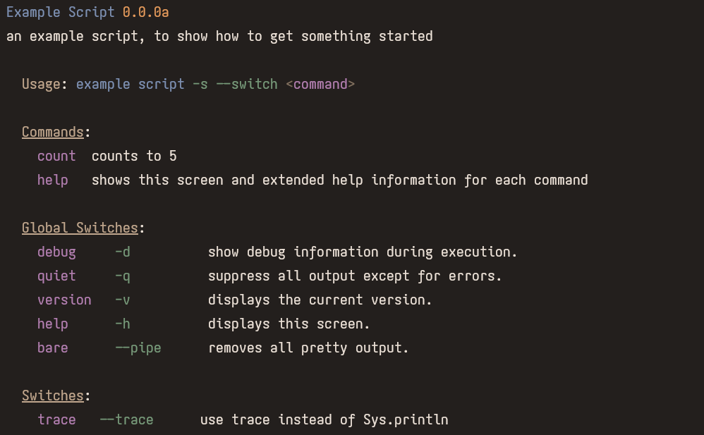
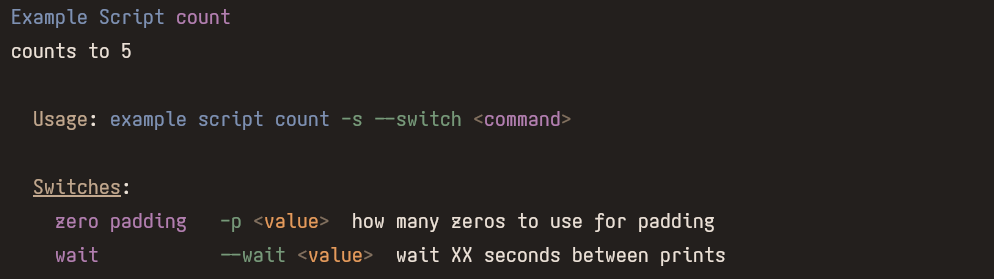

# TUI

A library with tools to make terminal applications easier.

## Examples

### examples/script.hxml

A script example. Has the following man (`neko script.n -h`)

And you can get mans for each command aswell (`neko script.n help count`)

